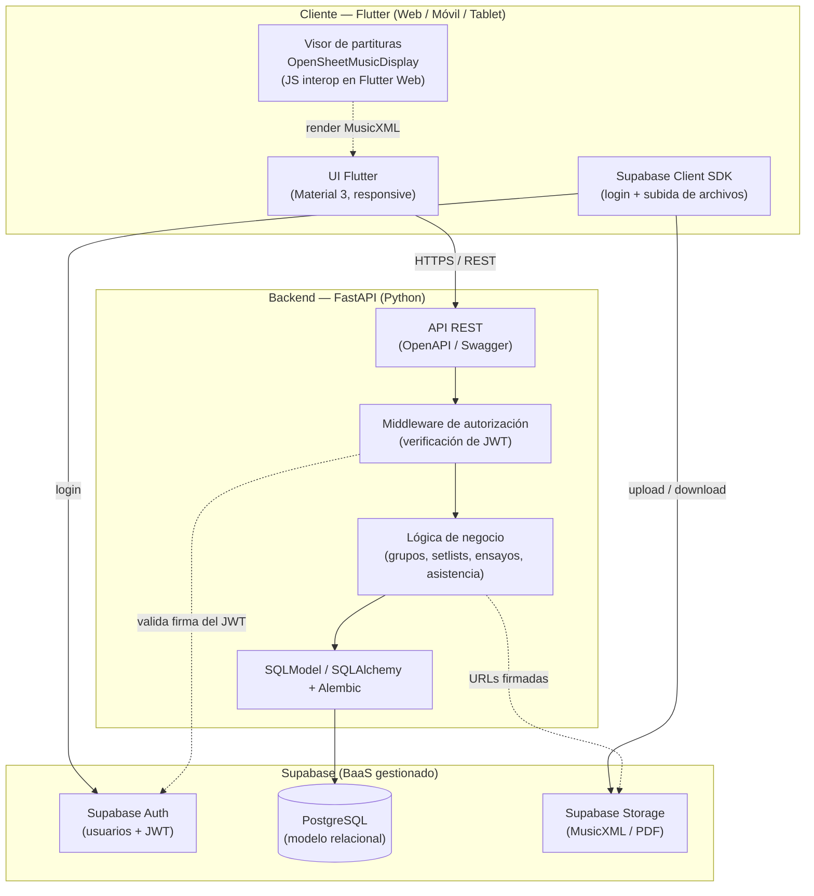
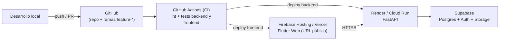
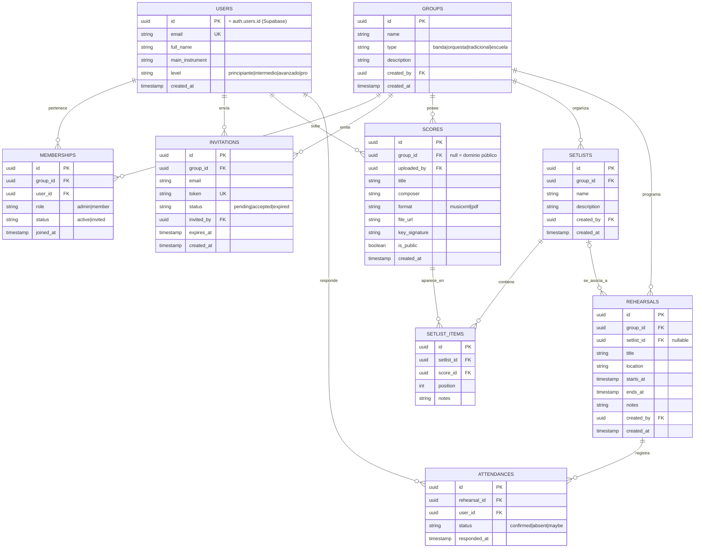

# XANEE — El espacio de trabajo para agrupaciones musicales

> _Nombre del producto: **XANEE** — espacio de trabajo colaborativo para músicos y agrupaciones._

## Índice

0. [Ficha del proyecto](#0-ficha-del-proyecto)
1. [Descripción general del producto](#1-descripción-general-del-producto)
2. [Arquitectura del sistema](#2-arquitectura-del-sistema)
3. [Modelo de datos](#3-modelo-de-datos)
4. [Especificación de la API](#4-especificación-de-la-api)
5. [Historias de usuario](#5-historias-de-usuario)
6. [Tickets de trabajo](#6-tickets-de-trabajo)
7. [Pull requests](#7-pull-requests)

---

## 0. Ficha del proyecto

### 0.1. Tu nombre completo

Alberto Fojo Eiras

### 0.2. Nombre del proyecto

**XANEE** — Plataforma integral para músicos y agrupaciones.

### 0.3. Descripción breve del proyecto

XANEE es un **espacio de trabajo colaborativo para agrupaciones musicales** (bandas, orquestas, grupos tradicionales y escuelas) que sustituye la fragmentación actual de herramientas genéricas (WhatsApp + Drive + Calendar) por un único ecosistema centrado en la utilidad musical. El MVP cubre el flujo de extremo a extremo de **un director que crea un grupo, invita a sus músicos, programa un ensayo con un repertorio (Setlist) de partituras y recibe la confirmación de asistencia**, con visualización de partituras en estándar abierto **MusicXML**.

### 0.4. URL del proyecto

_[Pendiente: URL pública del despliegue — se publicará en la Entrega final. Frontend Flutter Web en Firebase Hosting/Vercel; API FastAPI en Render/Cloud Run.]_

### 0.5. URL o archivo comprimido del repositorio

https://github.com/albertofojo/AI4Devs-finalproject — Rama de la Entrega 1: `feature-entrega1-AFE`.

---

## 1. Descripción general del producto

### 1.1. Objetivo

**Propósito.** Resolver la fragmentación de herramientas que sufren los músicos y las agrupaciones, centralizando en una sola plataforma la comunicación del grupo, la gestión del repertorio (partituras) y la logística de ensayos.

**Valor que aporta y para quién.**

| Perfil | Problema actual | Valor que aporta XANEE |
|---|---|---|
| **Director / administrador de grupo** | Coordina ensayos por WhatsApp, reparte partituras por Drive, persigue confirmaciones a mano. | Crea el grupo, convoca ensayos con su repertorio asociado y ve la asistencia confirmada en un único lugar. |
| **Músico miembro** | No sabe qué estudiar para el próximo ensayo; busca la partitura correcta entre chats. | Recibe la convocatoria, ve exactamente el Setlist que tiene que preparar y abre cada partitura renderizada al instante. |
| **Agrupación (banda/orquesta)** | Información dispersa y volátil, dependiente de personas concretas. | Memoria organizada y persistente del grupo: repertorios, histórico de ensayos y asistencia. |

**Filosofía de producto.** Utilidad sobre red social: XANEE no es un "muro" social masivo, sino un espacio de trabajo (estilo Slack/Teams) optimizado para música. La **unidad mínima de crecimiento es el grupo**: cuando un director adopta la herramienta, arrastra a todos sus músicos, generando adopción orgánica y alta retención.

### 1.2. Características y funcionalidades principales

El **MVP (Entrega 1–3)** se centra en un flujo E2E que combina tres de los pilares del producto:

1. **Gestión de cuentas y perfiles** — registro/login de músicos con su instrumento principal y nivel (Supabase Auth).
2. **Grupos y membresías** — un director crea un grupo, invita a músicos por email/enlace y gestiona roles (administrador / miembro).
3. **Gestor de partituras (motor MusicXML)** — subida de partituras (MusicXML/PDF), almacenamiento por grupo y **visualización renderizada** con OpenSheetMusicDisplay.
4. **Repertorios (Setlists)** — agrupación ordenada de partituras para un evento concreto.
5. **Gestión de ensayos** — convocatoria de ensayos con fecha/lugar, Setlist asociado y **control de asistencia** (Confirmado / Ausente / En duda).

> **Diferenciador del MVP:** la vinculación directa **Ensayo → Setlist → Partitura renderizada** permite que cada músico sepa, con un solo toque, *qué tiene que estudiar* y *abra la partitura* sin salir de la app.

**Visión de producto (fuera del MVP — documentada como roadmap):** Modo Directo con sincronización en escenario y pedales Bluetooth, grabadora de ensayos y Play-Along (variación de tempo / aislamiento de pistas), inventario de instrumentos con conectividad IoT (sensores de humedad BLE) y Bolsa de Sustitutos geolocalizada. Estas capacidades quedan explícitamente **fuera del alcance evaluable** por restricciones de tiempo (~30 h) y de demostrabilidad en una URL pública.

### 1.3. Diseño y experiencia de usuario

Aplicación **multiplataforma con Flutter** (un único código para Web, móvil y tablet), priorizando el uso en tablet sobre el atril. El despliegue evaluable es la **versión Web**.

Flujo principal del MVP (recorrido del usuario):

```
[Registro/Login] → [Crear grupo] → [Invitar músicos] → [Subir partituras]
       │                                                      │
       ▼                                                      ▼
[El músico acepta la invitación]                  [Crear Setlist ordenado]
       │                                                      │
       └──────────────► [Programar ensayo + asociar Setlist] ◄┘
                                     │
                                     ▼
                 [El músico confirma asistencia y abre el Setlist]
                                     │
                                     ▼
                 [Visor MusicXML: ve y estudia su partitura]
```

> _Nota para la Entrega final: incluir capturas / vídeo breve (2–3 min) del flujo en funcionamiento, tal y como recomienda la guía._

### 1.4. Instrucciones de instalación

> El detalle definitivo se completará en la Entrega 2 (código). Arquitectura prevista:

**Requisitos previos:** Flutter SDK ≥ 3.x, Python ≥ 3.11, cuenta gratuita de Supabase.

```bash
# 1. Backend (FastAPI)
cd backend
python -m venv .venv && source .venv/bin/activate   # En Windows: .venv\Scripts\activate
pip install -r requirements.txt
cp .env.example .env          # Rellenar SUPABASE_URL, SUPABASE_JWT_SECRET, DATABASE_URL
alembic upgrade head          # Migraciones del esquema relacional
uvicorn app.main:app --reload # API en http://localhost:8000 (docs en /docs)

# 2. Frontend (Flutter)
cd ../frontend
flutter pub get
cp .env.example .env          # Rellenar SUPABASE_URL, SUPABASE_ANON_KEY, API_BASE_URL
flutter run -d chrome         # App web en local
```

---

## 2. Arquitectura del sistema

### 2.1. Diagrama de arquitectura



**Patrón arquitectónico.** Arquitectura cliente–servidor en tres capas con un **backend propio (FastAPI)** que concentra la lógica de negocio y la autorización, apoyado en **Supabase como Backend-as-a-Service** para autenticación, base de datos relacional y almacenamiento de archivos.

**Justificación, beneficios y sacrificios:**

- **Por qué backend propio + BaaS:** Supabase aporta gratis (free tier, restricción de coste €0) la autenticación, el Postgres gestionado y el storage; FastAPI nos da control total sobre las reglas de negocio (quién puede invitar, validación de asistencia, acceso a partituras por grupo) y una **API REST documentada automáticamente** (OpenAPI), que es además un requisito de la entrega.
- **Beneficios:** despliegue barato/gratuito, modelo de datos relacional limpio (ideal para grupos↔miembros↔ensayos↔asistencia), un único lenguaje de cliente (Dart/Flutter) para Web y móvil.
- **Sacrificios / riesgos:** (1) el **render de MusicXML** (OpenSheetMusicDisplay) es una librería JavaScript, por lo que el visor avanzado se garantiza en **Flutter Web** vía *JS interop*; (2) los planes gratuitos pueden introducir *cold starts* (Render) o límites de uso; (3) dependemos de un proveedor (Supabase), mitigable porque Postgres es estándar y portable.

### 2.2. Descripción de componentes principales

- **Frontend (Flutter):** UI multiplataforma (Material 3, responsive). Integra el **Supabase Client SDK** para login y subida/descarga de archivos, y **OpenSheetMusicDisplay** (vía `HtmlElementView`/JS interop en Web) para renderizar partituras MusicXML.
- **Backend (FastAPI, Python):** expone la API REST, valida los JWT emitidos por Supabase Auth, aplica la lógica de negocio y persiste mediante SQLModel/SQLAlchemy. Genera documentación OpenAPI en `/docs`.
- **Supabase Auth:** registro/login y emisión de JWT. El backend verifica la firma del token en cada petición protegida.
- **PostgreSQL (Supabase):** base de datos relacional; esquema versionado con Alembic.
- **Supabase Storage:** almacén de los ficheros de partitura (MusicXML/PDF), con acceso mediante URLs firmadas y políticas por grupo.

### 2.3. Descripción de alto nivel del proyecto y estructura de ficheros

Estructura de monorepo prevista (se materializa en la Entrega 2):

```
xanee/
├── backend/                 # API FastAPI (Python)
│   ├── app/
│   │   ├── main.py          # Punto de entrada y router raíz
│   │   ├── core/            # Config, seguridad (JWT), dependencias
│   │   ├── models/          # Modelos SQLModel (tablas)
│   │   ├── schemas/         # DTOs Pydantic (request/response)
│   │   ├── api/             # Routers por dominio (groups, scores, rehearsals…)
│   │   ├── services/        # Lógica de negocio
│   │   └── db/              # Sesión y conexión a Postgres
│   ├── alembic/             # Migraciones del esquema
│   └── tests/               # Tests unitarios y de integración (pytest)
├── frontend/                # App Flutter
│   ├── lib/
│   │   ├── main.dart
│   │   ├── core/            # Theming, routing, cliente HTTP/Supabase
│   │   ├── features/        # auth, groups, scores, setlists, rehearsals
│   │   │   └── <feature>/   # data / domain / presentation
│   │   └── shared/          # Widgets reutilizables (visor MusicXML)
│   ├── test/                # Tests de widget/unidad
│   └── integration_test/    # Test E2E del flujo principal
├── .github/workflows/       # CI/CD (GitHub Actions)
├── docs/                    # Diagramas y documentación adicional
├── README.md
└── prompts.md
```

Patrón: el frontend sigue una organización **feature-first** con separación por capas (data/domain/presentation); el backend se organiza por capas (modelos, esquemas, routers, servicios).

### 2.4. Infraestructura y despliegue



- **Frontend:** `flutter build web` → desplegado en **Firebase Hosting** (o Vercel) → URL pública accesible.
- **Backend:** contenedor FastAPI desplegado en **Render** (free) o **Google Cloud Run**.
- **Datos/Auth/Storage:** **Supabase** gestionado (free tier).
- **CI/CD:** **GitHub Actions** ejecuta lint + tests en cada PR y despliega al hacer merge. Gestión de secretos mediante variables de entorno del proveedor y *GitHub Secrets* (nunca en el repo).

> El pipeline CI/CD y la URL pública se completan en las Entregas 2 y 3; en la Entrega 1 se documenta la estrategia.

### 2.5. Seguridad

- **Autenticación** delegada en Supabase Auth (JWT). El backend **verifica la firma** del token en cada endpoint protegido.
- **Autorización por grupo:** la lógica de negocio comprueba que el usuario pertenece al grupo y tiene el rol adecuado (p. ej., solo un administrador invita o crea ensayos).
- **Acceso a partituras** mediante **URLs firmadas** de Supabase Storage con expiración; ficheros segmentados por grupo.
- **Transporte cifrado** (HTTPS) extremo a extremo.
- **Gestión de secretos** vía variables de entorno y GitHub Secrets; nada de credenciales en el código.
- **Validación de entradas** con Pydantic en el backend para mitigar inyección/datos malformados.

### 2.6. Tests

Estrategia de pruebas prevista (se implementa en Entregas 2–3):

- **Unitarios (backend):** `pytest` sobre la lógica de negocio (reglas de invitación, validación de estados de asistencia, ordenación de Setlists).
- **Integración (backend):** `pytest` + cliente de prueba de FastAPI contra una BD de test (Postgres efímero) para validar los endpoints y la persistencia.
- **Unidad/Widget (frontend):** `flutter test` para widgets y lógica de presentación.
- **E2E (≥ 1, requisito):** `integration_test` de Flutter recorriendo el flujo principal: login → crear grupo → invitar → subir partitura → crear Setlist → programar ensayo → confirmar asistencia → abrir partitura.

---

## 3. Modelo de datos

### 3.1. Diagrama del modelo de datos



### 3.2. Descripción de entidades principales

| Entidad | Descripción | Claves / relaciones |
|---|---|---|
| **USERS** | Perfil del músico. El `id` coincide con el usuario de Supabase Auth. | PK `id`; UK `email`. |
| **GROUPS** | Agrupación musical (banda/orquesta/…). | PK `id`; FK `created_by → USERS`. |
| **MEMBERSHIPS** | Tabla de unión usuario↔grupo con **rol** y **estado**. Modela la pertenencia N:M. | PK `id`; FK `group_id`, `user_id`; UK (`group_id`,`user_id`). |
| **INVITATIONS** | Invitación a un grupo por email con token y caducidad. | PK `id`; FK `group_id`, `invited_by`; UK `token`. |
| **SCORES** | Partitura (MusicXML/PDF) almacenada en Storage. `group_id` nulo = dominio público. | PK `id`; FK `group_id`, `uploaded_by`. |
| **SETLISTS** | Repertorio ordenado de partituras para un evento. | PK `id`; FK `group_id`, `created_by`. |
| **SETLIST_ITEMS** | Tabla de unión setlist↔partitura con **orden** (`position`). | PK `id`; FK `setlist_id`, `score_id`. |
| **REHEARSALS** | Ensayo/evento con fecha, lugar y Setlist opcional asociado. | PK `id`; FK `group_id`, `setlist_id?`, `created_by`. |
| **ATTENDANCES** | Respuesta de asistencia de un músico a un ensayo. | PK `id`; FK `rehearsal_id`, `user_id`; UK (`rehearsal_id`,`user_id`). |

**Cardinalidades clave:** un usuario pertenece a muchos grupos y un grupo tiene muchos usuarios (N:M vía `MEMBERSHIPS`); un Setlist contiene muchas partituras y una partitura puede estar en muchos Setlists (N:M vía `SETLIST_ITEMS`); un ensayo registra una respuesta de asistencia por músico (N:M usuario↔ensayo vía `ATTENDANCES`).

---

## 4. Especificación de la API

API REST sobre HTTPS, autenticada con **Bearer JWT** (token de Supabase). Documentación interactiva generada automáticamente por FastAPI en `/docs` (OpenAPI 3). A continuación, los endpoints del flujo MVP y tres ejemplos detallados.

**Resumen de endpoints:**

| Método | Ruta | Descripción | Auth |
|---|---|---|---|
| GET | `/api/me` | Perfil del usuario autenticado | ✅ |
| PUT | `/api/me` | Actualizar perfil (instrumento, nivel) | ✅ |
| POST | `/api/groups` | Crear grupo (el creador queda como admin) | ✅ |
| GET | `/api/groups` | Listar mis grupos | ✅ |
| GET | `/api/groups/{id}` | Detalle del grupo | ✅ (miembro) |
| POST | `/api/groups/{id}/invitations` | Invitar músico por email | ✅ (admin) |
| POST | `/api/invitations/{token}/accept` | Aceptar invitación | ✅ |
| POST | `/api/groups/{id}/scores` | Subir partitura (MusicXML/PDF) | ✅ (miembro) |
| GET | `/api/groups/{id}/scores` | Listar partituras del grupo | ✅ (miembro) |
| POST | `/api/groups/{id}/setlists` | Crear Setlist | ✅ (miembro) |
| POST | `/api/setlists/{id}/items` | Añadir partitura al Setlist (con orden) | ✅ (miembro) |
| POST | `/api/groups/{id}/rehearsals` | Programar ensayo (con Setlist opcional) | ✅ (admin) |
| GET | `/api/rehearsals/{id}` | Detalle del ensayo + Setlist + asistencia | ✅ (miembro) |
| PUT | `/api/rehearsals/{id}/attendance` | Fijar mi asistencia (confirmed/absent/maybe) | ✅ (miembro) |

### Ejemplo 1 — Crear grupo

```http
POST /api/groups
Authorization: Bearer <jwt>
Content-Type: application/json

{
  "name": "Banda Municipal de Ejemplo",
  "type": "banda",
  "description": "Agrupación de viento y percusión"
}
```

```http
201 Created
{
  "id": "9b1f...c2",
  "name": "Banda Municipal de Ejemplo",
  "type": "banda",
  "created_by": "a3e1...77",
  "created_at": "2026-05-31T10:00:00Z",
  "my_role": "admin"
}
```

### Ejemplo 2 — Programar ensayo con Setlist asociado

```http
POST /api/groups/9b1f...c2/rehearsals
Authorization: Bearer <jwt>
Content-Type: application/json

{
  "title": "Ensayo general previo al concierto",
  "location": "Auditorio Municipal — Sala 2",
  "starts_at": "2026-06-10T18:00:00Z",
  "ends_at": "2026-06-10T20:00:00Z",
  "setlist_id": "4c77...ab",
  "notes": "Repasar dinámicas del 2º movimiento"
}
```

```http
201 Created
{
  "id": "e5d0...91",
  "title": "Ensayo general previo al concierto",
  "starts_at": "2026-06-10T18:00:00Z",
  "setlist": { "id": "4c77...ab", "name": "Concierto de Primavera", "items_count": 6 },
  "attendance_summary": { "confirmed": 0, "absent": 0, "maybe": 0, "pending": 24 }
}
```

### Ejemplo 3 — Confirmar asistencia

```http
PUT /api/rehearsals/e5d0...91/attendance
Authorization: Bearer <jwt>
Content-Type: application/json

{ "status": "confirmed" }
```

```http
200 OK
{
  "rehearsal_id": "e5d0...91",
  "user_id": "a3e1...77",
  "status": "confirmed",
  "responded_at": "2026-05-31T11:30:00Z"
}
```

**Códigos de error comunes:** `400` validación, `401` token ausente/ inválido, `403` sin permiso en el grupo, `404` recurso inexistente, `409` conflicto (p. ej., invitación ya aceptada).

---

## 5. Historias de usuario

> Formato: rol – objetivo – beneficio, con criterios de aceptación en Gherkin. Prioridad **MoSCoW**. Trazabilidad con los tickets de la sección 6.

### HU-01 — Registro e inicio de sesión _(Must Have)_

**Como** músico, **quiero** registrarme e iniciar sesión con mi email, **para** acceder a mis grupos y a su actividad de forma segura.

**Criterios de aceptación:**
- **Dado** que no tengo cuenta, **cuando** me registro con email y contraseña válidos, **entonces** se crea mi cuenta y mi perfil queda disponible.
- **Dado** que tengo cuenta, **cuando** inicio sesión con credenciales correctas, **entonces** obtengo un token de sesión y accedo a la app.
- **Dado** un email ya registrado, **cuando** intento registrarme de nuevo, **entonces** recibo un error claro.

**Notas:** autenticación vía Supabase Auth (JWT). Trazabilidad: TK-01, TK-02.

### HU-02 — Crear un grupo _(Must Have)_

**Como** director, **quiero** crear un grupo, **para** disponer de un espacio de trabajo propio de mi agrupación.

**Criterios de aceptación:**
- **Dado** que estoy autenticado, **cuando** creo un grupo con nombre y tipo, **entonces** el grupo se crea y yo quedo registrado como **administrador**.
- **Cuando** accedo a mi listado, **entonces** veo los grupos a los que pertenezco.

**Trazabilidad:** TK-03, TK-04.

### HU-03 — Invitar y unir músicos al grupo _(Must Have)_

**Como** administrador, **quiero** invitar a músicos por email, **para** que se incorporen a mi grupo.

**Criterios de aceptación:**
- **Dado** que soy administrador del grupo, **cuando** invito a un email, **entonces** se genera una invitación con un enlace/token único y caducidad.
- **Dado** un token de invitación válido, **cuando** el músico la acepta, **entonces** pasa a ser **miembro** del grupo.
- **Dado** un token caducado o ya usado, **cuando** se intenta aceptar, **entonces** se rechaza con un mensaje claro.
- **Dado** que no soy administrador, **cuando** intento invitar, **entonces** recibo un `403`.

**Trazabilidad:** TK-05, TK-06, TK-07.

### HU-04 — Subir y visualizar una partitura _(Must Have)_

**Como** miembro del grupo, **quiero** subir partituras (MusicXML/PDF) y verlas renderizadas, **para** consultar el material musical sin salir de la app.

**Criterios de aceptación:**
- **Dado** que soy miembro, **cuando** subo un archivo MusicXML o PDF con título y compositor, **entonces** la partitura queda asociada al grupo y almacenada de forma segura.
- **Dado** una partitura MusicXML, **cuando** la abro en el visor, **entonces** se **renderiza la notación** correctamente (OpenSheetMusicDisplay) en la versión Web.
- **Dado** un archivo con formato no soportado, **cuando** intento subirlo, **entonces** se rechaza con un mensaje claro.

**Trazabilidad:** TK-08, TK-09, TK-10.

### HU-05 — Crear Setlist y programar ensayo _(Must Have)_

**Como** administrador, **quiero** crear un Setlist ordenado de partituras y programar un ensayo asociándolo, **para** que los músicos sepan qué estudiar.

**Criterios de aceptación:**
- **Dado** que soy administrador, **cuando** creo un Setlist y le añado partituras, **entonces** se guardan con el orden indicado.
- **Cuando** programo un ensayo con fecha, lugar y un Setlist, **entonces** el ensayo queda visible para todos los miembros con su repertorio asociado.
- **Cuando** un miembro abre el ensayo, **entonces** ve el Setlist y puede abrir cada partitura.

**Trazabilidad:** TK-11, TK-12, TK-13.

### HU-06 — Confirmar asistencia al ensayo _(Must Have)_

**Como** miembro, **quiero** confirmar mi asistencia a un ensayo (Confirmado/Ausente/En duda), **para** que el director conozca quién acudirá.

**Criterios de aceptación:**
- **Dado** un ensayo del que soy miembro, **cuando** fijo mi estado, **entonces** se guarda y puedo modificarlo después.
- **Cuando** el administrador abre el ensayo, **entonces** ve el **resumen de asistencia** (confirmados/ausentes/en duda/pendientes).

**Trazabilidad:** TK-14, TK-15.

### HU-07 — Transposición de tonalidad en el visor _(Should Have)_

**Como** músico, **quiero** transponer la tonalidad de una partitura MusicXML en el visor, **para** adaptarla a mi instrumento sin editar el archivo.

**Criterios de aceptación:**
- **Dado** una partitura MusicXML abierta, **cuando** selecciono una transposición, **entonces** la notación se re-renderiza en la nueva tonalidad.

**Trazabilidad:** TK-16. _(Opcional; no bloquea el flujo E2E.)_

### HU-08 — Notas por tema en el ensayo _(Should Have)_

**Como** administrador, **quiero** añadir notas/comentarios a temas concretos dentro de un ensayo, **para** dar indicaciones de estudio específicas.

**Trazabilidad:** TK-17. _(Opcional.)_

---

## 6. Tickets de trabajo

> Cada ticket indica tipo, historia de origen (trazabilidad), descripción y criterios de aceptación técnicos. Se muestran desarrollados los de las historias del núcleo del flujo; el resto se listan de forma resumida.

### TK-03 — [Backend] Endpoint y modelo para crear grupo

- **Tipo:** Backend · **Historia:** HU-02 · **Estimación:** 3 pts
- **Descripción:** Crear el modelo `Group` y `Membership` (SQLModel) y el endpoint `POST /api/groups`. Al crear el grupo, registrar al usuario autenticado como `membership(role=admin, status=active)`.
- **Criterios de aceptación:**
  - Migración Alembic crea las tablas `groups` y `memberships` con sus FKs y restricción única (`group_id`,`user_id`).
  - `POST /api/groups` valida el cuerpo (Pydantic), persiste y devuelve `201` con `my_role: "admin"`.
  - Un usuario no autenticado recibe `401`.
  - Test de integración cubre creación correcta y membresía admin generada.

### TK-04 — [Frontend] Pantalla de creación y listado de grupos

- **Tipo:** Frontend · **Historia:** HU-02 · **Estimación:** 3 pts
- **Descripción:** Formulario Flutter para crear grupo y vista de listado de "mis grupos" consumiendo `POST/GET /api/groups`.
- **Criterios de aceptación:**
  - El formulario valida nombre obligatorio y tipo; muestra errores del backend.
  - Tras crear, se navega al detalle del grupo y aparece en el listado.
  - Estado de carga y de error gestionados; test de widget del formulario.

### TK-05 — [Backend] Crear y enviar invitación a grupo

- **Tipo:** Backend · **Historia:** HU-03 · **Estimación:** 3 pts
- **Descripción:** `POST /api/groups/{id}/invitations`: genera `Invitation` con token único y `expires_at`; solo administradores.
- **Criterios de aceptación:**
  - Solo un `admin` del grupo puede invitar (resto `403`).
  - Se genera token único y caducidad configurable; estado inicial `pending`.
  - Test cubre creación, control de rol y unicidad de token.

### TK-06 — [Backend] Aceptar invitación

- **Tipo:** Backend · **Historia:** HU-03 · **Estimación:** 2 pts
- **Descripción:** `POST /api/invitations/{token}/accept`: valida token, crea la membresía `member/active` y marca la invitación `accepted`.
- **Criterios de aceptación:**
  - Token válido y `pending` → crea membresía y responde `200`.
  - Token caducado/usado → `409` con mensaje claro; estado `expired` si procede.
  - Idempotencia: aceptar dos veces no duplica la membresía.

### TK-08 — [Backend] Subida de partitura y registro de metadatos

- **Tipo:** Backend · **Historia:** HU-04 · **Estimación:** 3 pts
- **Descripción:** `POST /api/groups/{id}/scores`: valida formato (`musicxml|pdf`), guarda el fichero en Supabase Storage y persiste `Score` con `file_url` y metadatos.
- **Criterios de aceptación:**
  - Solo miembros del grupo pueden subir (`403` en otro caso).
  - Formatos no soportados → `400`.
  - El fichero queda en Storage segmentado por grupo; la URL de acceso es firmada/temporal.

### TK-09 — [Frontend] Subida de partitura

- **Tipo:** Frontend · **Historia:** HU-04 · **Estimación:** 2 pts
- **Descripción:** Selector de archivo + formulario de metadatos (título, compositor) integrando el Supabase Client para la subida.
- **Criterios de aceptación:** validación de formato en cliente, barra de progreso, manejo de error y refresco del listado.

### TK-10 — [Frontend] Visor de partituras MusicXML (OpenSheetMusicDisplay)

- **Tipo:** Frontend · **Historia:** HU-04 · **Estimación:** 5 pts · **Riesgo:** Alto
- **Descripción:** Integrar OpenSheetMusicDisplay en Flutter Web vía JS interop (`HtmlElementView`) para renderizar el MusicXML descargado.
- **Criterios de aceptación:**
  - Una partitura MusicXML válida se renderiza legible en navegador.
  - Estados de carga/error contemplados (archivo corrupto → mensaje claro).
  - Documentada la limitación de plataforma (Web como target del visor avanzado).

### TK-11 — [Backend] Setlists y orden de partituras

- **Tipo:** Backend · **Historia:** HU-05 · **Estimación:** 3 pts
- **Descripción:** Modelos `Setlist` y `SetlistItem` + endpoints de creación y de añadir ítem con `position`.
- **Criterios de aceptación:** se respeta el orden (`position`); reordenar actualiza posiciones; solo miembros operan.

### TK-12 — [Backend] Programar ensayo con Setlist

- **Tipo:** Backend · **Historia:** HU-05 · **Estimación:** 3 pts
- **Descripción:** `POST /api/groups/{id}/rehearsals` con `setlist_id` opcional; solo administradores.
- **Criterios de aceptación:** FK válida a Setlist del mismo grupo; respuesta incluye resumen de Setlist; control de rol admin.

### TK-13 — [Frontend] Crear Setlist y programar ensayo

- **Tipo:** Frontend · **Historia:** HU-05 · **Estimación:** 5 pts
- **Descripción:** UI para componer un Setlist (selección + reordenación) y formulario de ensayo con selección de Setlist.

### TK-14 — [Backend] Registro de asistencia

- **Tipo:** Backend · **Historia:** HU-06 · **Estimación:** 2 pts
- **Descripción:** `PUT /api/rehearsals/{id}/attendance` (upsert por usuario) y resumen agregado en el detalle del ensayo.
- **Criterios de aceptación:** estados válidos `confirmed|absent|maybe`; upsert idempotente; resumen correcto por estado.

### TK-15 — [Frontend] Confirmar asistencia y ver Setlist del ensayo

- **Tipo:** Frontend · **Historia:** HU-06 · **Estimación:** 3 pts
- **Descripción:** Vista de detalle de ensayo con selector de asistencia y acceso a las partituras del Setlist (abre TK-10).

### Tickets adicionales (resumen)

| Ticket | Tipo | Historia | Descripción |
|---|---|---|---|
| TK-01 | Backend | HU-01 | Integración Supabase Auth + verificación de JWT (middleware) |
| TK-02 | Frontend | HU-01 | Pantallas de registro/login con Supabase Client |
| TK-07 | Frontend | HU-03 | Pantalla de invitaciones y aceptación por enlace |
| TK-16 | Frontend | HU-07 | Transposición de tonalidad en el visor (Should) |
| TK-17 | Full-stack | HU-08 | Notas por tema en el ensayo (Should) |
| TK-18 | Infra | — | Pipeline CI/CD (GitHub Actions) + despliegue Web/API |
| TK-19 | QA | — | Test E2E del flujo principal (integration_test) |

---

## 7. Pull requests

Trabajo mediante Pull Requests con título claro y descripción detallada (qué cambia, por qué, impacto) y referencia a la historia/ticket.

- **PR-1 — Entrega 1: Documentación técnica.** Rama `feature-entrega1-AFE`. Incluye `README.md` (ficha, producto, arquitectura, modelo de datos, API, historias y tickets) y `prompts.md`. PR: https://github.com/albertofojo/AI4Devs-finalproject/pull/1
- **PR-2 — Entrega 2: MVP funcional.** Rama `feature-entrega2-AFE`. Backend FastAPI
  (API REST del flujo HU-01..HU-06, autenticación con JWT de Supabase, 9 modelos +
  migración Alembic, 14 tests pytest) y frontend Flutter Web (auth, grupos,
  invitaciones, partituras con visor MusicXML/OpenSheetMusicDisplay, setlists, ensayos
  y asistencia), más CI (GitHub Actions) y test E2E del flujo principal. PR: https://github.com/albertofojo/AI4Devs-finalproject/pull/2
- **PR-3 — Entrega final.** Rama `finalproject-AFE`. Despliegue en URL pública
  (API en Render, Web en Firebase/Vercel, datos en Supabase) y documentación cerrada. _[Pendiente]_
