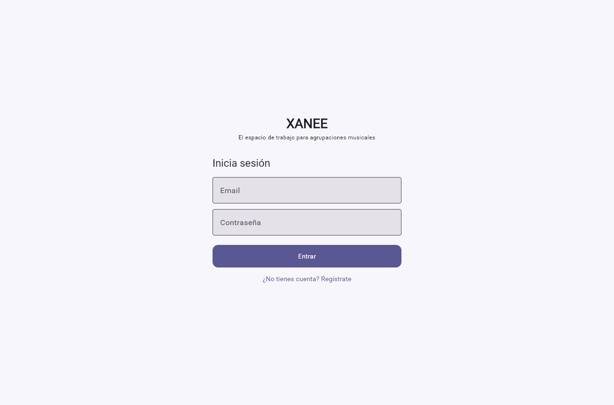
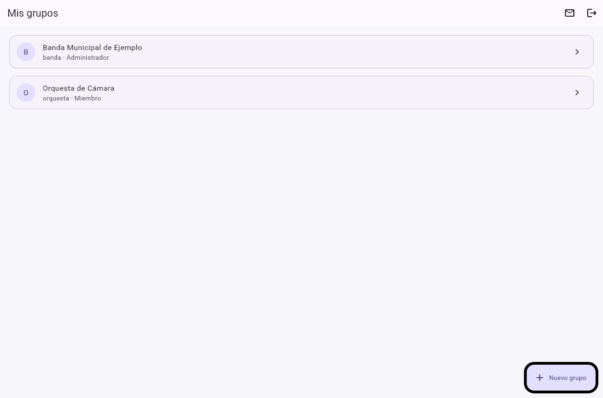
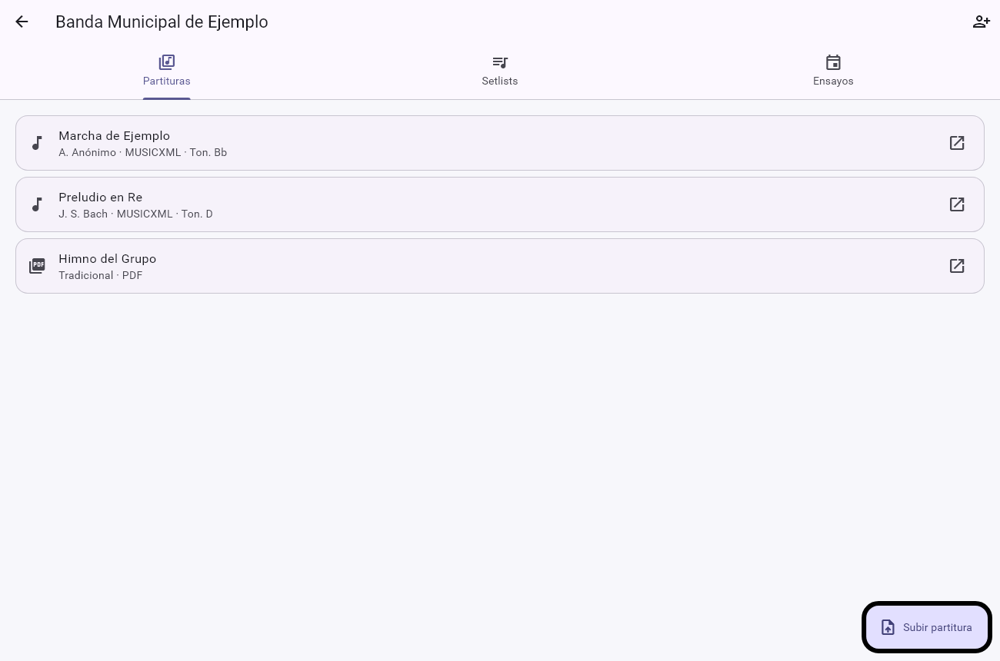
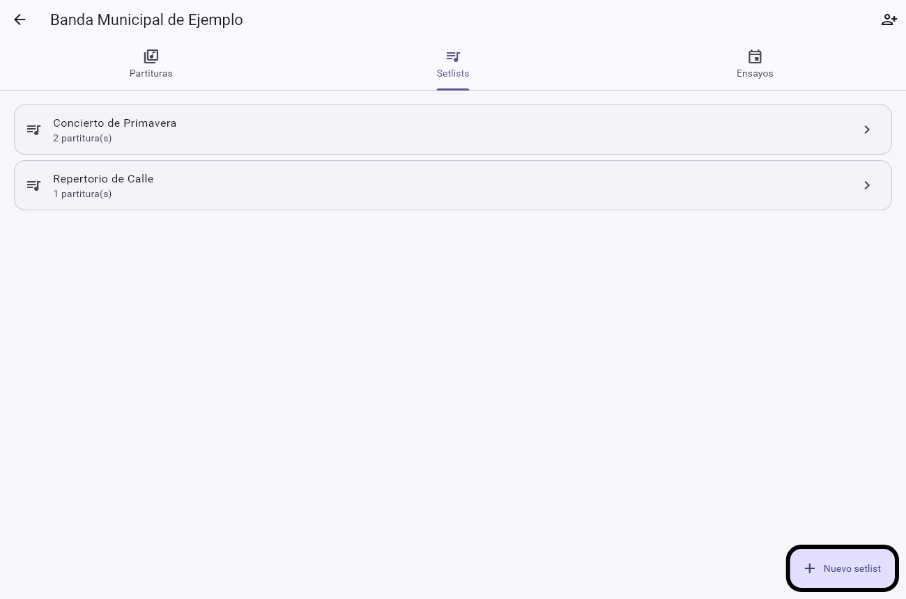
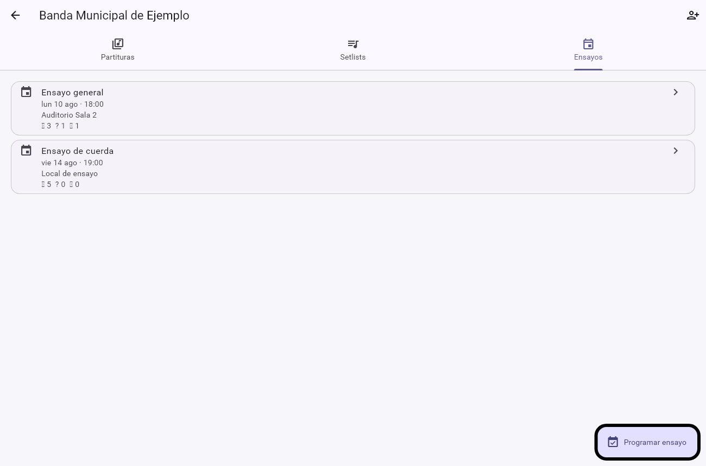
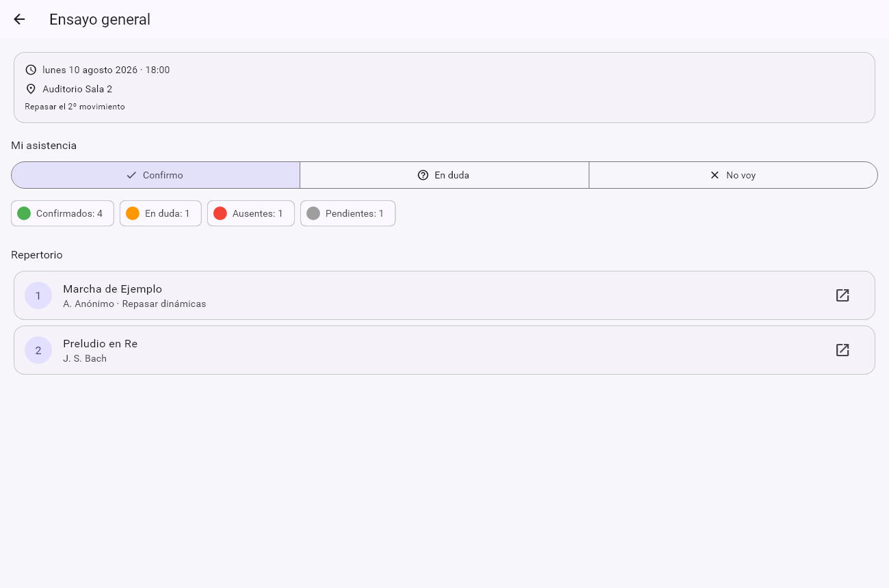
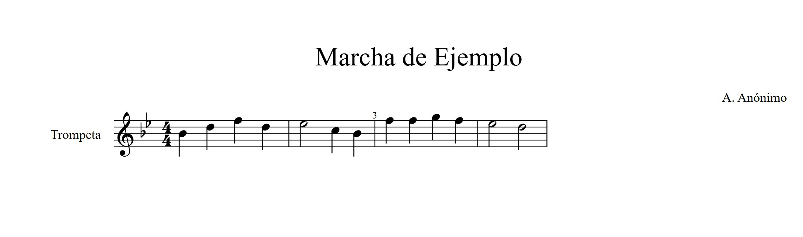

# 🎬 Demo guiada del flujo — XANEE

Recorrido de extremo a extremo del MVP de **XANEE**, el espacio de trabajo para
agrupaciones musicales. Este documento sirve como guion para la demostración (y para
grabar el vídeo breve de 2–3 min recomendado en la entrega).

**Aplicación en vivo:** https://xanee-afe.vercel.app · **API:** https://xanee-api.onrender.com/docs

> ℹ️ La API está en el plan gratuito de Render y "duerme" tras inactividad: la **primera**
> petición puede tardar ~30–50 s en responder (arranque en frío). A partir de ahí, fluido.

---

## Flujo principal (E2E)

El MVP cubre el recorrido completo que aporta valor a una agrupación: de crear el grupo a
que cada músico sepa **qué estudiar** y **confirme su asistencia**.

```
[Registro/Login] → [Crear grupo] → [Invitar músicos] → [Subir partituras]
       │                                                      │
       ▼                                                      ▼
[El músico acepta la invitación]                  [Crear Setlist ordenado]
       │                                                      │
       └──────────────► [Programar ensayo + asociar Setlist] ◄┘
                                     │
                                     ▼
                 [El músico confirma asistencia y abre el Setlist]
                                     │
                                     ▼
                 [Visor MusicXML: ve y estudia su partitura]
```

Cada paso mapea a una historia de usuario (HU-01…HU-06) del `README.md`.

---

## 1. Registro e inicio de sesión · _HU-01_

La entrada a XANEE. El registro y el login usan **Supabase Auth**; el backend verifica el
JWT en cada petición protegida.



> **En la demo:** pulsa *Regístrate*, crea una cuenta con email y contraseña y entra. (Para
> la demo, la confirmación por email está desactivada, así que el acceso es inmediato.)

---

## 2. Mis grupos · _HU-02_

Al entrar, el director ve los grupos a los que pertenece y su rol en cada uno
(**Administrador** o **Miembro**). Desde aquí crea un grupo nuevo o acepta una invitación.



> **En la demo:** pulsa **+ Nuevo grupo**, ponle nombre y tipo (banda, orquesta…). Quedas
> registrado automáticamente como **administrador** del grupo.

---

## 3. Partituras del grupo · _HU-04_

Dentro del grupo, la pestaña **Partituras** muestra el repertorio. Se suben ficheros
**MusicXML** o **PDF** (a Supabase Storage) con su título, compositor y tonalidad.



> **En la demo:** pulsa **Subir partitura**, elige un `.musicxml`, rellena los metadatos y
> guarda. Como administrador, además puedes **invitar músicos** (icono ✉️ arriba): se genera
> un token que compartes para que se unan al grupo _(HU-03)_.

---

## 4. Setlists (repertorios) · _HU-05_

Un **Setlist** es una lista ordenada de partituras para un evento concreto. Es lo que
convierte un montón de archivos en "lo que toca preparar para el próximo concierto".



> **En la demo:** crea un setlist (p. ej. *Concierto de Primavera*), ábrelo y añade
> partituras del grupo; se guardan **en orden**.

---

## 5. Ensayos · _HU-05_

La pestaña **Ensayos** lista las convocatorias con su fecha, lugar y un resumen rápido de
asistencia (✓ confirmados / ? en duda / ✗ ausentes).



> **En la demo (como admin):** pulsa **Programar ensayo**, indica título, fecha/hora, lugar
> y **asocia el Setlist**. El ensayo queda visible para todos los miembros con su repertorio.

---

## 6. Detalle del ensayo y asistencia · _HU-06_

El corazón del producto. Cada músico abre el ensayo y ve **exactamente qué estudiar** (el
Setlist ordenado) y **confirma su asistencia** (Confirmo / En duda / No voy). El
administrador ve el **resumen agregado** en tiempo real.



> **En la demo:** pulsa **Confirmo** y observa cómo cambia el contador de *Confirmados*.
> Cada partitura del repertorio tiene un botón para abrirla en el visor (↗).

---

## 7. Visor de partituras MusicXML · _HU-04 (diferenciador)_

El paso final del flujo y el **diferenciador técnico** del MVP: al tocar una partitura del
Setlist, se abre renderizada con **OpenSheetMusicDisplay**, sin salir de la app. El músico
ve la notación real de lo que tiene que estudiar.



> **En la demo:** desde el detalle del ensayo (o desde Partituras), abre una partitura
> MusicXML y muestra la notación renderizada. Este es el "momento wow" del recorrido:
> **Ensayo → Setlist → Partitura renderizada** en un solo toque.

---

## Guion sugerido para el vídeo (2–3 min)

1. **(0:00)** Abre https://xanee-afe.vercel.app y regístrate. *(Menciona el cold start si tarda.)*
2. **(0:20)** Crea el grupo "Banda Municipal". Enseña que quedas como administrador.
3. **(0:40)** Sube una partitura MusicXML y ábrela un momento en el visor.
4. **(1:10)** Crea un Setlist y añádele 2 partituras en orden.
5. **(1:35)** Programa un ensayo asociando ese Setlist.
6. **(2:00)** Abre el ensayo, **confirma asistencia** y muestra el resumen actualizándose.
7. **(2:20)** Abre una partitura del repertorio en el visor — cierre con el "momento wow".

> Todas las capturas de este documento están en `docs/screenshots/` y se regeneran con
> `flutter test --update-goldens test/screenshots_test.dart` (más la del visor, que usa la
> misma librería OpenSheetMusicDisplay del producto).
